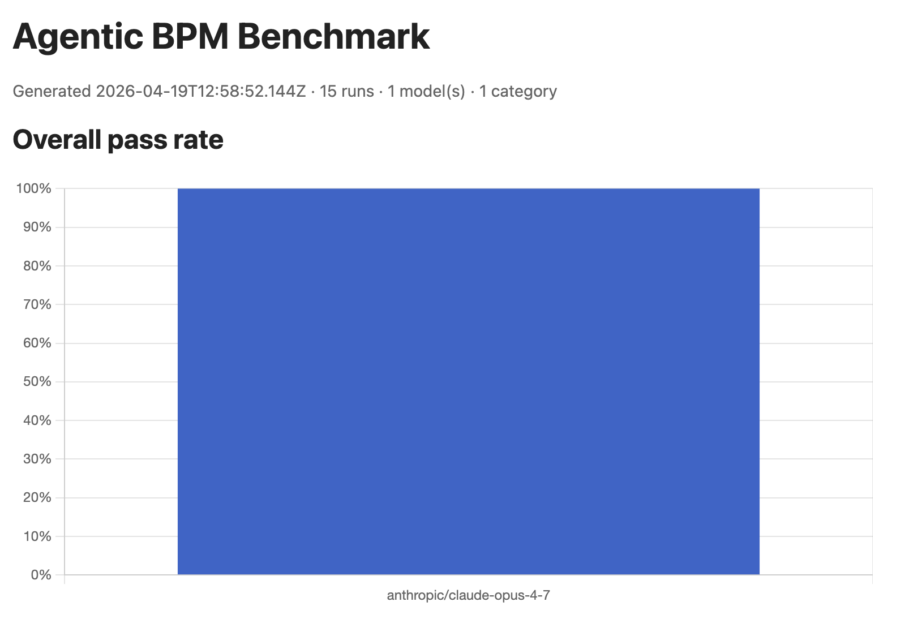
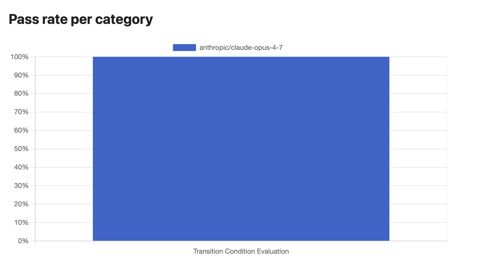
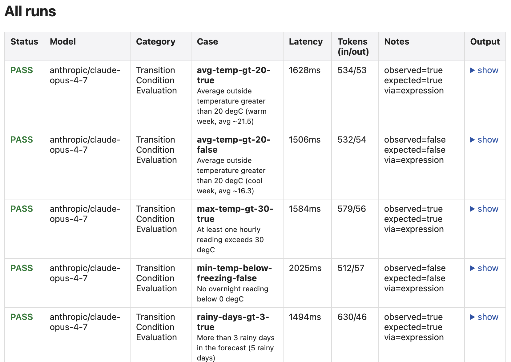

# agentic-bpm-2026

A benchmark for measuring how reliably current reasoning LLMs perform the
small, well-defined tasks that an agentic process engine delegates to a model
at runtime — transition-condition evaluation, input/output data mappings, and
related BPM primitives — when the relevant business data is kept **external**
to the model and passed in per call as a semantic data pool.

## Background

This repository accompanies ongoing research on design principles for
**agentic process engines**: systems in which an LLM mediates the execution
of business processes (making local decisions, applying data transformations,
routing) while the authoritative business state is maintained *outside* the
model, in a structured data pool that is supplied to each LLM call and
written back deterministically. A recurring question in that line of work is:
how well do today's reasoning LLMs actually handle the individual execution
steps a process engine would ask of them?

This benchmark isolates those steps one at a time and answers the question
empirically. The engine architecture, the design principles themselves, and
the broader evaluation are discussed in a separate (unpublished) manuscript;
this repo is deliberately limited to the measurement harness.

## What is measured

Each **category** corresponds to one well-defined BPM execution step. Each
**case** fixes a semantic data pool, a task description, and an expected
result. The harness runs every configured LLM against every case and scores
the output structurally (not by LLM-as-judge), so results are reproducible.

Currently implemented:

- **Transition Condition Evaluation** (15 cases) — given a data pool and a
  condition in natural language, the model must answer `true` / `false`. It
  may either decide directly (useful for sentiment or textual cues) or return
  a JSONata expression that, when evaluated against the data pool, yields the
  answer (useful for aggregates, counts, and arithmetic). Cases cover
  numeric aggregates over weather readings, shopping-cart totals,
  subscription status, inactivity windows, three flavours of confirmation
  intent, three flavours of user-upset detection, and compound conditions.

Planned (not yet implemented): Input and Output Data Mappings, and further
categories as the research progresses.

## Quick start

```bash
cp .env.example .env
# fill in ANTHROPIC_API_KEY (and optionally ANTHROPIC_MODEL)
npm install
npm run bench
```

Outputs:

- `results/run-<ISO-timestamp>.json` — full per-case raw data (prompt output,
  latency, tokens, notes).
- `report.html` — static HTML report with Chart.js bar charts and an
  expandable per-run table.

## Running against a single LLM

```bash
npm run bench -- --connector anthropic
npm run bench -- --connector anthropic --model claude-sonnet-4-6
npm run bench -- --connector anthropic,openai --category transition-condition
npm run bench -- --list
npm run bench -- --help
```

Known connector labels: `anthropic`, `openai`, `google`, `qwen`, `deepseek`,
`kimi`. Only `anthropic` ships with a real implementation; the others are
stubs — see [Adding a new connector](#adding-a-new-connector).

## What results look like

### CLI

```
Loading connectors...
  ✓ anthropic/claude-opus-4-7

Loading categories...
  ✓ transition-condition — Transition Condition Evaluation

▷ Transition Condition Evaluation — 15 cases
  anthropic/claude-opus-4-7
    ✓ avg-temp-gt-20-true        (1843ms) — observed=true  expected=true  via=expression
    ✓ avg-temp-gt-20-false       (1612ms) — observed=false expected=false via=expression
    ✓ max-temp-gt-30-true        (1488ms) — observed=true  expected=true  via=expression
    ...
    ✗ user-upset-subtle          (2031ms) — observed=false expected=true  via=direct
    ...

=== Summary ===
  anthropic/claude-opus-4-7: 93.3% pass (15 cases, avg 1784ms)

Wrote results/run-*.json and report.html
```

### HTML report

Open `report.html` in any browser. It embeds three things:

1. **Overall pass rate per model** (bar chart).
2. **Pass rate per category, per model** (grouped bar chart).
3. **Full run table** with per-case status, latency, token usage, scoring
   notes, and the raw LLM output behind an expandable `<details>`.

Drop screenshots under `docs/screenshots/` once you've generated them:

<!-- replace these with real screenshots when ready -->



*Overall pass rate per model.*



*Pass rate grouped by category, per model.*



*Per-case table: status, latency, tokens, notes, and the raw model output
behind each row.*

## Project layout

```
src/
  connectors/         LLMConnector interface + one class per provider
    LLMConnector.ts
    AnthropicConnector.ts     (implemented)
    OpenAIConnector.ts        (stub)
    GoogleConnector.ts        (stub)
    QwenConnector.ts          (stub)
    DeepSeekConnector.ts      (stub)
    KimiConnector.ts          (stub)
    index.ts                  registry + CLI filter
  categories/         one module per BPM task type
    Category.ts
    TransitionCondition.ts
    index.ts
  expression/
    evaluate.ts               JSONata wrapper
  runner.ts           orchestrates connectors × categories × cases
  report.ts           summary + HTML/Chart.js report
  index.ts            CLI entry
benchmarks/
  transition-condition/*.json    one case per file
```

## Adding a new connector

The harness treats an LLM as a single `complete(prompt, options)` call. To
add a provider you only touch one file (a new `<Provider>Connector.ts`) and
keep one line in `src/connectors/index.ts`.

### 1. The contract

```ts
// src/connectors/LLMConnector.ts

export interface LLMConnector {
  readonly provider: string;   // stable id used in CLI filters & reports, e.g. "openai"
  readonly name: string;       // the specific model, e.g. "gpt-5"
  complete(prompt: string, options?: CompleteOptions): Promise<LLMResponse>;
}

export interface CompleteOptions {
  systemPrompt?: string;
  temperature?: number;        // forward only if set — some models reject it
  maxTokens?: number;
}

export interface LLMResponse {
  text: string;                // raw model text (JSON-shaped for current categories)
  inputTokens?: number;
  outputTokens?: number;
  latencyMs: number;
}
```

### 2. Worked example — filling in the OpenAI stub

Replace the stubbed `src/connectors/OpenAIConnector.ts` body with:

```ts
import OpenAI from "openai";
import type { CompleteOptions, LLMConnector, LLMResponse } from "./LLMConnector.js";

export interface OpenAIConnectorOptions {
  model?: string;
  apiKey?: string;
  baseURL?: string;  // for OpenAI-compatible endpoints (DeepSeek, Kimi, Qwen…)
}

export class OpenAIConnector implements LLMConnector {
  readonly provider = "openai";
  readonly name: string;
  private readonly client: OpenAI;

  constructor(options: OpenAIConnectorOptions = {}) {
    const apiKey = options.apiKey ?? process.env.OPENAI_API_KEY;
    if (!apiKey) throw new Error("OpenAIConnector: OPENAI_API_KEY is not set");
    this.client = new OpenAI({ apiKey, baseURL: options.baseURL });
    this.name = options.model ?? "gpt-5";
  }

  async complete(prompt: string, options: CompleteOptions = {}): Promise<LLMResponse> {
    const start = Date.now();
    const res = await this.client.chat.completions.create({
      model: this.name,
      max_tokens: options.maxTokens ?? 2048,
      ...(options.temperature !== undefined ? { temperature: options.temperature } : {}),
      messages: [
        ...(options.systemPrompt ? [{ role: "system" as const, content: options.systemPrompt }] : []),
        { role: "user" as const, content: prompt },
      ],
    });
    const choice = res.choices[0];
    return {
      text: choice?.message?.content ?? "",
      inputTokens: res.usage?.prompt_tokens,
      outputTokens: res.usage?.completion_tokens,
      latencyMs: Date.now() - start,
    };
  }
}
```

### 3. Rules the harness relies on

- **Constructor throws on missing API key / missing native SDK.** The
  connector registry catches these and quietly skips that provider, so
  `npm run bench -- --connector anthropic` stays clean even when no other
  keys are configured.
- **Do not forward `temperature` unconditionally.** Newer reasoning models
  deprecate it outright (Claude Opus 4.7 is one example). Forward only when
  the caller actually supplies one — the pattern above is safe.
- **Return raw text, not parsed JSON.** The category module owns parsing, so
  different providers do not need bespoke post-processing.
- **Always populate `latencyMs`.** Tokens are optional but strongly
  recommended; they show up in the HTML report.
- **`provider` is the stable CLI label.** Pick a short lower-case string
  (`openai`, `qwen`, …) and do not change it between releases — it is what
  users type as `--connector <label>`.

### 4. Register the connector

`src/connectors/index.ts` already imports each stub and lists it in
`FACTORIES`. Once you replace the stub body, the existing line keeps
working:

```ts
{ label: "openai", build: () => new OpenAIConnector({ model: process.env.OPENAI_MODEL }) },
```

Two things to verify:

- `label` matches the class's `provider` and the `--connector <label>` value.
- Any new env vars your constructor reads are documented in `.env.example`.

### 5. OpenAI-compatible endpoints (Qwen / DeepSeek / Kimi)

Several vendors ship OpenAI-compatible APIs. You can reuse `OpenAIConnector`
by subclassing it with a different base URL and env var — no duplicate
request logic:

```ts
// src/connectors/DeepSeekConnector.ts
import { OpenAIConnector } from "./OpenAIConnector.js";

export class DeepSeekConnector extends OpenAIConnector {
  override readonly provider = "deepseek";
  constructor(options: { model?: string } = {}) {
    super({
      apiKey: process.env.DEEPSEEK_API_KEY,
      baseURL: "https://api.deepseek.com",
      model: options.model ?? "deepseek-reasoner",
    });
  }
}
```

Apply the same pattern for Qwen (DashScope compatible-mode endpoint) and
Kimi (Moonshot endpoint). See the existing stub files for the exact URLs.

### 6. Native SDKs

Where a provider's native SDK gives meaningful extras — extended thinking,
streaming, tool calls, structured output, context caching — prefer the
native SDK. `AnthropicConnector` is the reference implementation. The
interface is unchanged; just instantiate the native client in the
constructor and map its response fields inside `complete()`.

### 7. Run it

```bash
npm run typecheck
npm run bench -- --connector openai
npm run bench -- --connector openai,anthropic --category transition-condition
```

## Adding a new category

1. In `src/categories/`, implement `Category<TCase, TOutput>`:
   - define `TCase extends BenchmarkCase` with your case shape and `expected`
     type;
   - implement `loadCases`, `buildPrompt`, `parseOutput`, and `score`
     (returns `{ pass, score, notes? }`).
2. Append the new class to the `ALL` array in `src/categories/index.ts`.
3. Put the cases under `benchmarks/<category-id>/*.json`.

`src/categories/TransitionCondition.ts` is the reference implementation. It
demonstrates robust JSON extraction (plain parse / fenced-code / brace
fallback), JSONata-based expression scoring, and a direct-boolean fallback.

## Test case format

Each case is one JSON file. Transition-condition example:

```json
{
  "id": "avg-temp-gt-20-true",
  "description": "Average outside temperature > 20°C (warm week)",
  "dataPool": {
    "weather": {
      "temperatures": [18.5, 21.2, 23.8, 19.4, 22.1, 24.0, 21.5]
    }
  },
  "condition": "The average outside temperature is greater than 20 degrees Celsius.",
  "expected": { "value": true }
}
```

The model is asked to reply with either a direct boolean or a JSONata
expression that evaluates to a boolean. A case passes when the resulting
boolean equals `expected.value`.

## License

MIT — see `LICENSE`.
